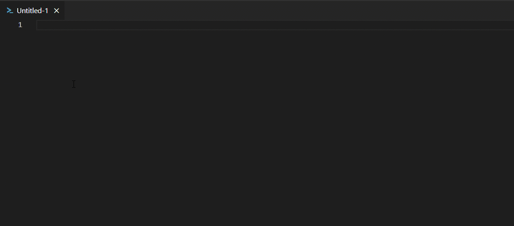

# Powershell Excel Snippets

This extension contains code snippets for the PowerShell Excel module for the Vs Code editor.
## Features

## Snippets

|Trigger|Description|
|---|---|
|ps-ExcelExport|Export A PowerShell Array to Excel File|
|ps-ExcelImport|Export Get-Process to Excel File|
|ps-ExcelConditionalFormat|Export Excel apply conditional formatting|
|ps-ExcelChart|Export Excel and charting|
|ps-ExcelPivot|Export Excel and Pivot Tables|
|ps-ExcelAutoNameRange|Export Excel and AutoNameRange|
|ps-ExcelTableName|Export Excel and TableName|
|ps-ExcelAutoSize|Export Excel and AutoSize|
|ps-ExcelAutoFilter|Export Excel and AutoFilter|
|ps-ExcelOpenPackage|Export Excel and OpenPackage|
|ps-ExcelPassThru|Export Excel and use PassThru|

 

## Requirements

If you have any requirements or dependencies, add a section describing those and how to install and configure them.