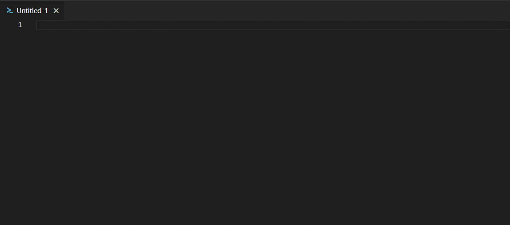
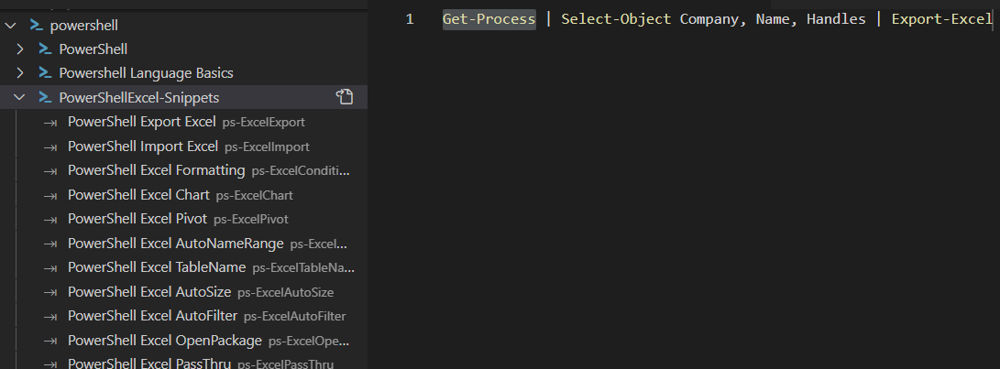

# Powershell Excel Snippets

This extension contains code snippets for the PowerShell Excel module for the Vs Code editor.
## Features

Export `Get-Process` to Excel.

## Snippets

Below is a list of all available snippets and the triggers of each one.

|Trigger|Description|
|---|---|
|ps-ExcelExport|Export `Get-Process` to Excel|
|ps-ExcelImport|Export Get-Process to Excel File|
|ps-ExcelConditionalFormat|Export Excel apply conditional formatting|
|ps-ExcelChart|Export to Excel adding a chart|
|ps-ExcelPivot|Export Excel and create Pivot Tables|
|ps-ExcelAutoNameRange|Export Excel using `AutoNameRange`|
|ps-ExcelTableName|Export Excel using a `TableName`|
|ps-ExcelAutoSize|Export Excel using `AutoSize`|
|ps-ExcelAutoFilter|Export Excel using `AutoFilter`|
|ps-ExcelOpenPackage|Use `OpenPackage` with an Excel file |
|ps-ExcelPassThru|Export Excel using `PassThru`|

 

## Snippets Viewer

Also I used this great extension to make quick work of it.

**Snippets Viewer ⇥ for VSCode**.

View built-in and extension snippets grouped by language in the Snippets Tree View, and much more

### Snippets Viewer is in the Marketplace

https://marketplace.visualstudio.com/items?itemName=RandomFractalsInc.snippets-viewer